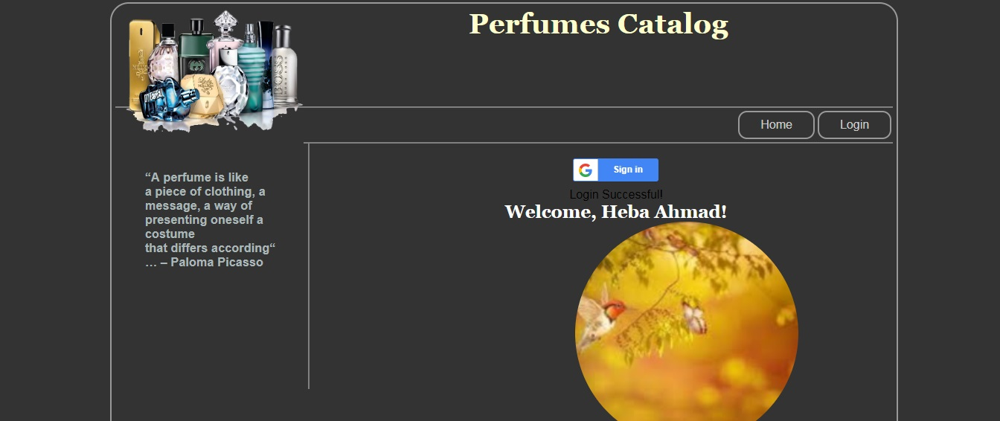
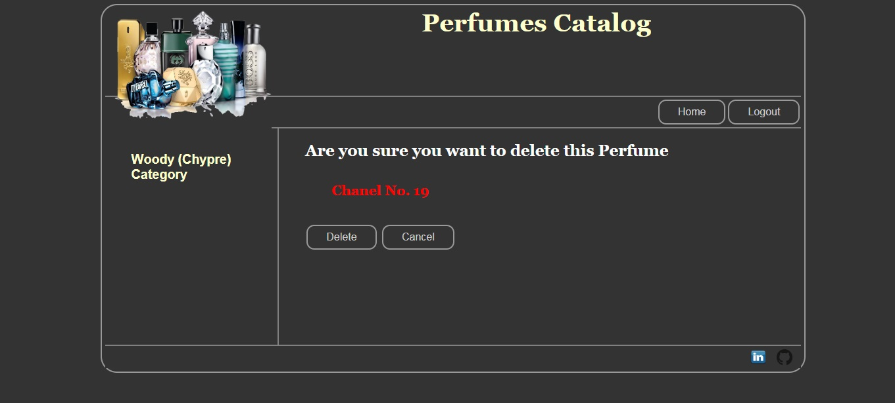

# Item-Catalog-Application

Udacity Full Stack Web Developer Nanodegree project4 developed by Heba Sa'ada

## About The Project
Perfumes Catalog Application, is the name of my application provides a list of top selections of perfumes within a variety of categories as well as provide a user registration and authentication system. Registered users will have the ability to add, edit, and delete their own items.

## Getting Started
To start running the application on your device you need to [clone](https://github.com/Heba-ahmad/ItemCatalogApplication.git)* or *[download](https://github.com/Heba-ahmad/ItemCatalogApplication.git)* this project via [GitHub](https://github.com) to your local machine.

### Project Structure
```
.
├── application.py
├── client_secrets.json
├── database_setup.py
├── lotsofperfumes.py
├── README.md
├── static
│   └── style.css
│   └── logo.png
│   └── github.png
│   └── linkedin.png
└── templates
    ├── addPerfume1.html
    ├── deletePerfume.html
    ├── editPerfume.html
    ├── header.html
    ├── home.html
    ├── login.html
    ├── moreInfo.html
    ├── publichome.html
    ├── publicperfumes.html
    └── topperfumes.html
```
## How to Run?
### Prerequisites
* [Python ~2.7](https://www.python.org/)
* Unix-style terminal or for Windows user [Git Bash terminal](https://git-scm.com/downloads))
* [VirtualBox](https://www.virtualbox.org/wiki/Downloads)
* [Vagrant](https://www.vagrantup.com/downloads.html)
* [VM configuration](https://d17h27t6h515a5.cloudfront.net/topher/2017/August/59822701_fsnd-virtual-machine/fsnd-virtual-machine.zip)

### Installing or initializing

- Unzip the **VM configuration** and add the catalog application folder inside **vagrant** folder
- Use the **Git Bash** or **Terminal** to get into the **vagrant** folder from **VM configuration** by running the following command:

> $ vagrant up

- This will let vagrant to download the Linux operating system and install it.
- After it finished, run the following command:

> $ vagrant ssh

- to let you login to the Linux VM. (Please do not shut down the terminal after the login)
- write the following command for running the application:
```
 $ cd /vagrant
 $ cd vagrant
 $ cd catalog
 $ python database_setup.py
 $ python lotsofperfumes.py
 $ python application.py
```

- Once it is up and running, open your browser to visit [localhost:8000 link](http://localhost:8000/)

### How to use
* Here the different categories with the items in public home page.
> [](Image)
* You can login and create, edit and delete just you top favorite perfumes.
> [](Image)
* I'm trying to edit as an admin.
* You can edit an item that you created.
> [](Image)
----
> [](Image)
----
> [](Image)
----
> [](Image)

### Debugging
If the application doesn't run, make sure of the following points:
* You have run database_setup.py before running the application.
* you have The latest version of Flask 1.x is installed.

## Acknowledgment
* Fragrance and Perfumes information provided form:
- https://www.liveabout.com/types-of-perfume-346103
* Projects were helpful to me:
- https://github.com/arrickx/Item-Catalog-Application
- https://github.com/sagarchoudhary96/P5-Item-Catalog/blob/master/main.py
- https://github.com/SDey96/Udacity-Item-Catalog-Project/blob/master/app.py
